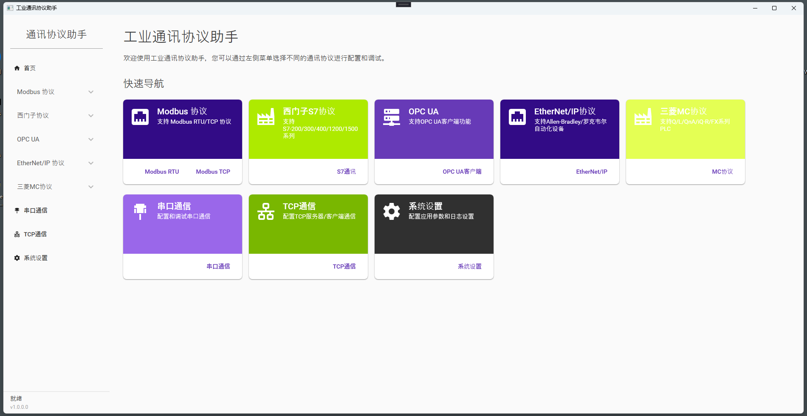
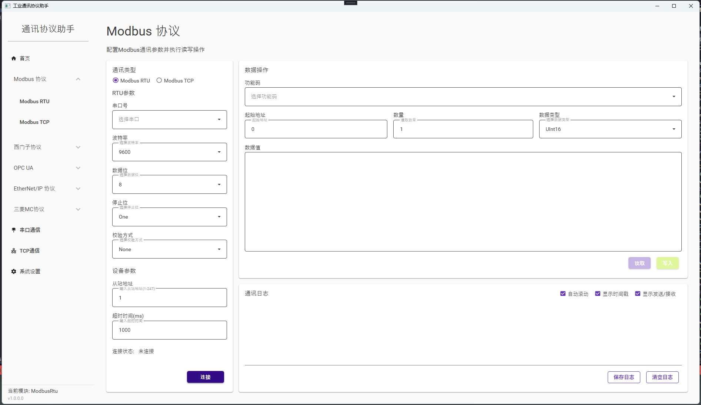

# Communication Protocol Assistant

## 项目概述
Communication Protocol Assistant 是一款基于WPF的工业通讯协议助手软件，旨在提供一个用户友好、功能强大的平台来配置、调试和监控各种工业通讯协议。该软件采用现代化UI设计，结构清晰，并支持多种工业通讯协议，方便工程师进行设备连接、数据交换和监控。







## 主要功能
- **多协议支持**：包括Modbus RTU/TCP、Profinet、EtherNet/IP、OPC UA、Siemens S7等工业通讯协议
- **实时监控**：实时显示通讯数据，支持数据趋势图和状态监控
- **协议配置**：直观的协议参数配置界面，支持配置模板保存与加载
- **数据分析**：数据记录、分析和导出功能
- **日志系统**：详细的通讯日志和系统日志记录
- **设备管理**：多设备连接管理和配置
- **自动化测试**：支持自动化测试脚本编写和执行

## 技术特点
- 基于.NET 6.0和最新WPF技术
- MVVM架构设计，代码逻辑清晰
- 使用Material Design风格UI
- 模块化设计，便于扩展
- 完善的错误处理和异常管理

## 项目结构
```
CommunicationProtocol.WPF
│
├── App.xaml / App.xaml.cs              # 应用程序入口
├── MainWindow.xaml / MainWindow.xaml.cs # 主窗口
│
├── Models                              # 数据模型
│   ├── Protocols                       # 通讯协议模型
│   └── Configuration                   # 配置模型
│
├── ViewModels                          # 视图模型
│   ├── MainViewModel.cs                # 主视图模型
│   ├── ProtocolViewModel.cs            # 协议视图模型
│   └── ConfigViewModel.cs              # 配置视图模型
│
├── Views                               # 视图
│   ├── ProtocolViews                   # 协议相关视图
│   ├── ConfigurationViews              # 配置视图
│   └── MonitorViews                    # 监控视图
│
├── Services                            # 服务
│   ├── ProtocolServices                # 协议实现服务
│   ├── ConfigurationService            # 配置服务
│   └── LoggingService                  # 日志服务
│
├── Utils                               # 工具类
│   ├── Converters                      # 转换器
│   └── Helpers                         # 辅助类
│
└── Resources                           # 资源
    ├── Images                          # 图像资源
    ├── Styles                          # 样式定义
    └── Templates                       # 控件模板
```

## 使用的库
- MaterialDesignThemes - UI界面库
- Prism - MVVM框架
- NLog - 日志库
- LiveCharts - 图表控件
- Newtonsoft.Json - JSON序列化
- S7NetPlus - 西门子S7通讯库
- NModbus - Modbus通讯库
- OPCFoundation.NetStandard - OPC UA通讯库

## 开发环境
- Visual Studio 2022
- .NET 6.0 SDK
- Windows 10/11

## 安装与使用
1. 克隆或下载本仓库
2. 使用Visual Studio 2022打开解决方案
3. 恢复NuGet包
4. 编译并运行项目

## 贡献指南
欢迎提交Pull Request或Issue来改进此项目

## 许可证
MIT License 